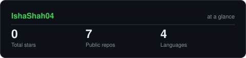
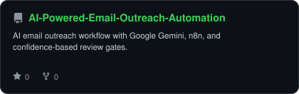
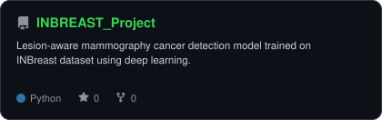
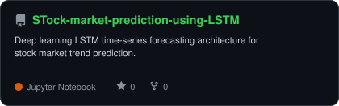
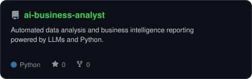

<div align="center">

<!-- ORIGINAL UNPIXELATED PHOTO -->


<br>

<!-- NAME / TAGLINE - animated typing (CINZEL DECORATIVE / ENGRAVED WHITE) -->
<a href="https://github.com/IshaShah04">
  
</a>

<br>

<!-- SOCIALS -->
<a href="https://github.com/IshaShah04"></a>


</div>

---

## `~/` whoami

```console
$ cat about.txt
```

Hi, I'm **Isha Shah**. I build intelligent workflows, machine learning models, and deep learning architectures.

- Currently building **[AI-Powered Email Outreach](https://github.com/IshaShah04/AI-Powered-Email-Outreach-Automation)** and **[INBREAST_Project](https://github.com/IshaShah04/INBREAST_Project)**
- Exploring **Agentic AI Automations (n8n), LLM Workflows & Medical Computer Vision**
- Focus: **Automating complex workflows with AI and deep learning**
- Core philosophy: **I learn. I build. I repeat.**

<br>

<div align="center">

## `~/` toolbox


</div>

---

<div align="center">

## `~/` skill radar

<table>
<tr>
<td width="50%" align="center" valign="middle">

<!-- Self-rated radar - edit assets/skills.json, the workflow redraws it -->
<picture>
  <source media="(prefers-color-scheme: dark)"  srcset="assets/radar-dark.svg">
  <source media="(prefers-color-scheme: light)" srcset="assets/radar-light.svg">
  
</picture>

</td>
<td width="50%" align="center" valign="middle">

<!-- Live radar built from real language byte counts across your repos -->
<picture>
  <source media="(prefers-color-scheme: dark)"  srcset="assets/radar-langs-dark.svg">
  <source media="(prefers-color-scheme: light)" srcset="assets/radar-langs-light.svg">
  
</picture>

</td>
</tr>
</table>

</div>

---

<div align="center">

## `~/` contribution calendar

<!-- 3D isometric calendar, regenerated every 6h by .github/workflows/metrics.yml -->


<br><br>

<!-- Snake eats the contribution graph - .github/workflows/snake.yml -->
<picture>
  <source media="(prefers-color-scheme: dark)"  srcset="https://raw.githubusercontent.com/IshaShah04/IshaShah04/output/snake-dark.svg">
  <source media="(prefers-color-scheme: light)" srcset="https://raw.githubusercontent.com/IshaShah04/IshaShah04/output/snake.svg">
  
</picture>

</div>

---

<div align="center">

## `~/` the numbers

<!-- Generated by scripts/cards.py into this repo. Deliberately NOT
     github-readme-stats / streak-stats / github-profile-trophy: those are
     shared public instances that go down and take the whole section with them. -->
<picture>
  <source media="(prefers-color-scheme: dark)"  srcset="assets/card-stats-dark.svg">
  <source media="(prefers-color-scheme: light)" srcset="assets/card-stats-light.svg">
  
</picture>

<br>


<br><br>


</div>

---

<div align="center">

## `~/` selected work

<!-- Cards generated by scripts/cards.py from assets/projects.json.
     Stars, forks and language are pulled live from the API on every run. -->
<table>
<tr>
<td width="50%">
  <a href="https://github.com/IshaShah04/AI-Powered-Email-Outreach-Automation">
    <picture>
      <source media="(prefers-color-scheme: dark)"  srcset="assets/card-AI-Powered-Email-Outreach-Automation-dark.svg">
      <source media="(prefers-color-scheme: light)" srcset="assets/card-AI-Powered-Email-Outreach-Automation-light.svg">
      
    </picture>
  </a>
</td>
<td width="50%">
  <a href="https://github.com/IshaShah04/INBREAST_Project">
    <picture>
      <source media="(prefers-color-scheme: dark)"  srcset="assets/card-INBREAST_Project-dark.svg">
      <source media="(prefers-color-scheme: light)" srcset="assets/card-INBREAST_Project-light.svg">
      
    </picture>
  </a>
</td>
</tr>
<tr>
<td width="50%">
  <a href="https://github.com/IshaShah04/STock-market-prediction-using-LSTM">
    <picture>
      <source media="(prefers-color-scheme: dark)"  srcset="assets/card-STock-market-prediction-using-LSTM-dark.svg">
      <source media="(prefers-color-scheme: light)" srcset="assets/card-STock-market-prediction-using-LSTM-light.svg">
      
    </picture>
  </a>
</td>
<td width="50%">
  <a href="https://github.com/IshaShah04/ai-business-analyst">
    <picture>
      <source media="(prefers-color-scheme: dark)"  srcset="assets/card-ai-business-analyst-dark.svg">
      <source media="(prefers-color-scheme: light)" srcset="assets/card-ai-business-analyst-light.svg">
      
    </picture>
  </a>
</td>
</tr>
</table>

<sub>

| project | category | stack |
|---|---|---|
| **[AI-Powered-Email-Outreach-Automation](https://github.com/IshaShah04/AI-Powered-Email-Outreach-Automation)** | AI Automation & Outreach | `n8n` `Google Gemini` `Gmail API` |
| **[INBREAST_Project](https://github.com/IshaShah04/INBREAST_Project)** | Cancer Detection ML | `Python` `Deep Learning` `PyTorch` |
| **[STock-market-prediction-using-LSTM](https://github.com/IshaShah04/STock-market-prediction-using-LSTM)** | Time-Series Forecasting | `Python` `LSTM` `Jupyter` |
| **[ai-business-analyst](https://github.com/IshaShah04/ai-business-analyst)** | AI Analytics Agent | `Python` `LLMs` `FastAPI` |

</sub>

</div>

---

<div align="center">

<sub>`01101001 00100000 01101100 01100101 01100001 01110010 01101110 00101110 00100000 01101001 00100000 01100010 01110101 01101001 01101100 01100100 00101110 00100000 01101001 00100000 01110010 01100101 01110000 01100101 01100001 01110100`</sub>

</div>
